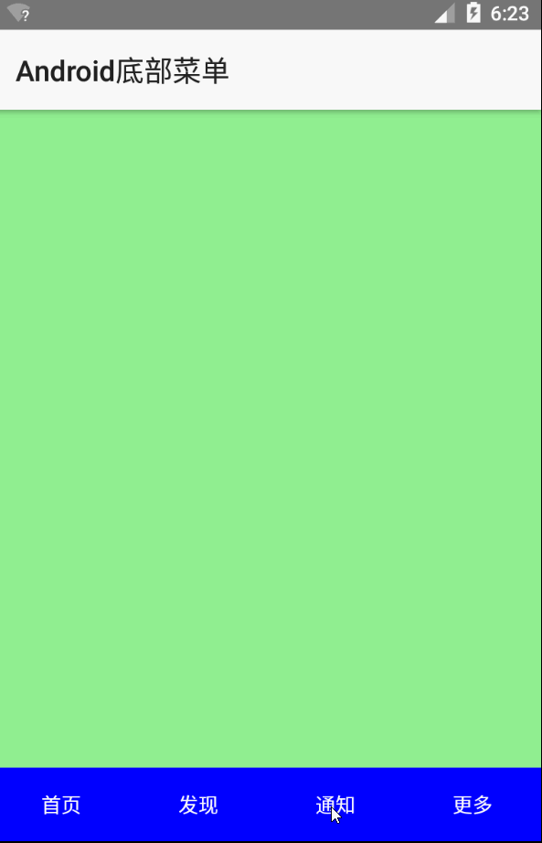

# nativescript-menudemo

Use segmented-bar  create app own customized bottom tabs for android

The tab-view can not be rendered at the bottom for Android. So terrible!

NativeScript  [ISSUE#2768](https://github.com/NativeScript/NativeScript/issues/2768)

NS安卓不支持tabview底部布局，使用**segmented-bar**模拟，但是感觉效率不如**tabview**，真是醉了。

用了一周的NS，感觉真是不太好。。

## ScreenShot

## License

MIT